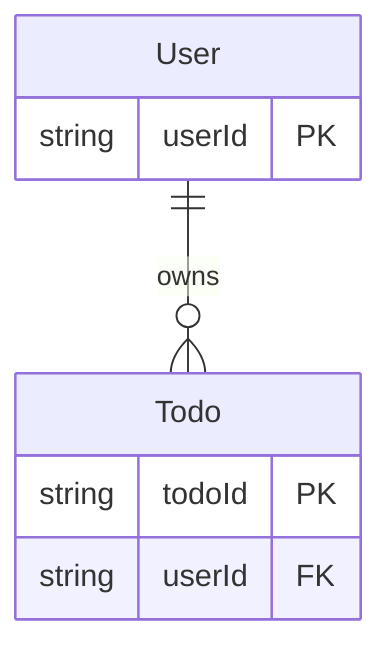
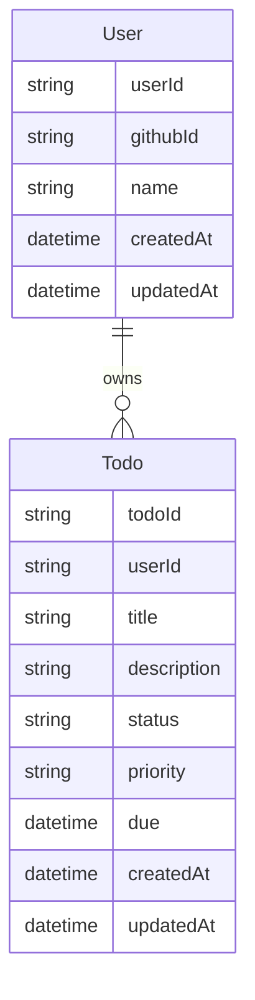

## エンティティ

- **User**：アプリ利用者（GitHub認証済）  
   主キー: `userId`
- **Todo**：ユーザーのタスク  
   主キー: `todoId`

## リレーション

### 関係

- **User (1) — (N) Todo**  
   所有関係：1ユーザーが複数のTodoを持つ。

### 外部キー

- 参照元 → 参照先：`Todo.userId → User.userId`
- 制約方針：
  - **ON DELETE CASCADE**（ユーザー削除時、そのユーザーのTodoを自動削除）
  - **ON UPDATE CASCADE**（`userId`変更時、Todo側も追従）  
     ※シンプル運用・孤児レコード防止を優先

### アプリ層の認可（補足）

- API 層で「`Todo.userId === セッションの userId`」を必須チェック（自分のTodoのみ操作可）。

## 属性定義

### User

| カラム名  | 型       | 必須 | 説明                                 |
| --------- | -------- | ---- | ------------------------------------ |
| userId    | string   | PK   | 内部的なユーザー識別子（UUID想定）   |
| githubId  | string   | 必須 | GitHubアカウントのID（外部識別子）   |
| name      | string   | 任意 | 表示名（GitHubプロフィールから取得） |
| createdAt | datetime | 必須 | 登録日時（自動付与）                 |
| updatedAt | datetime | 必須 | 更新日時（自動更新）                 |
|           |          |      |                                      |

### Todo

| カラム名    | 型       | 必須 | 説明                                                  |
| ----------- | -------- | ---- | ----------------------------------------------------- |
| todoId      | string   | PK   | TODO識別子（UUID想定）                                |
| userId      | string   | FK   | 所有ユーザーのID → User.userId                        |
| title       | string   | 必須 | タイトル                                              |
| description | string   | 任意 | 詳細説明、空文字可                                    |
| status      | enum     | 必須 | `"open"` / `"done"`、デフォルトは `"open"`            |
| priority    | enum     | 必須 | `"low"` / `"mid"` / `"high"`、デフォルトは `"mid"`    |
| due         | datetime | 任意 | 期限（`YYYY-MM-DD` をUTC 00:00に正規化、ISO8601も可） |
| createdAt   | datetime | 必須 | 作成日時（自動付与）                                  |
| updatedAt   | datetime | 必須 | 更新日時（自動更新）                                  |
|             |          |      |                                                       |

## ER図

## インデックス設計

### 方針

- 一覧はログインユーザーの自分のTODOのみが対象 → すべてのインデックスは `userId` 先頭で束ねる。
- 絞り込み：`status`, `priority`, `dueFrom/dueTo`, キーワード`q`、並び替え：`updatedAt`/`createdAt`/`due`。これに対応する。

### インデックス一覧

| テーブル | 種別         | カラム構成             | ねらい                                                               |
| -------- | ------------ | ---------------------- | -------------------------------------------------------------------- |
| User     | PK           | `(userId)`             | 主キー                                                               |
| User     | UNIQUE       | `(githubId)`           | GitHub連携の一意制約                                                 |
| Todo     | PK           | `(todoId)`             | 主キー                                                               |
| Todo     | FK用（単独） | `(userId)`             | 参照整合・結合の基本                                                 |
| Todo     | 2列複合      | `(userId, updatedAt)`  | デフォルトの一覧並び（更新降順）に最短アクセス。                     |
| Todo     | 2列複合      | `(userId, due)`        | 期限での範囲絞り＆並び替えを高速化。                                 |
| Todo     | 2列複合      | `(userId, status)`     | 未完/完了フィルタの選択に最適化。                                    |
| Todo     | 2列複合      | `(userId, priority)`   | 優先度フィルタの選択に最適化。                                       |
| Todo     | FULLTEXT     | `(title, description)` | `q`（タイトル・説明の部分一致/全文検索）を高速化（MySQL 8 で推奨）。 |

## 型・長さ

### User

| カラム    | 型(例: MySQL)   | Null | 既定値                 | 制約/備考                               |
| --------- | --------------- | ---- | ---------------------- | --------------------------------------- |
| userId    | CHAR(36)        | NO   | -                      | PK                                      |
| githubId  | BIGINT UNSIGNED | NO   | -                      | **UNIQUE**（GitHubの数値IDを想定）      |
| name      | VARCHAR(255)    | YES  | NULL                   | 表示名                                  |
| createdAt | DATETIME(3)     | NO   | `CURRENT_TIMESTAMP(3)` | 生成時自動                              |
| updatedAt | DATETIME(3)     | NO   | `CURRENT_TIMESTAMP(3)` | 更新時 `ON UPDATE CURRENT_TIMESTAMP(3)` |

### Todo

| カラム      | 型(例: MySQL)            | Null | 既定値                 | 制約/備考                                         |
| ----------- | ------------------------ | ---- | ---------------------- | ------------------------------------------------- |
| todoId      | CHAR(36)                 | NO   | -                      | PK                                                |
| userId      | CHAR(36)                 | NO   | -                      | FK → `User.userId`（CASCADE）                     |
| title       | VARCHAR(120)             | NO   | -                      | 必須・非空                                        |
| description | TEXT                     | NO   | `''`                   | 空文字OK                                          |
| status      | ENUM('open','done')      | NO   | `'open'`               | 状態切替APIと一致                                 |
| priority    | ENUM('low','mid','high') | NO   | `'mid'`                | 優先度の既定と一致                                |
| due         | DATETIME(3)              | YES  | NULL                   | `YYYY-MM-DD`受領時はUTC 00:00:00 に正規化（後述） |
| createdAt   | DATETIME(3)              | NO   | `CURRENT_TIMESTAMP(3)` | 生成時自動                                        |
| updatedAt   | DATETIME(3)              | NO   | `CURRENT_TIMESTAMP(3)` | 更新時自動                                        |
